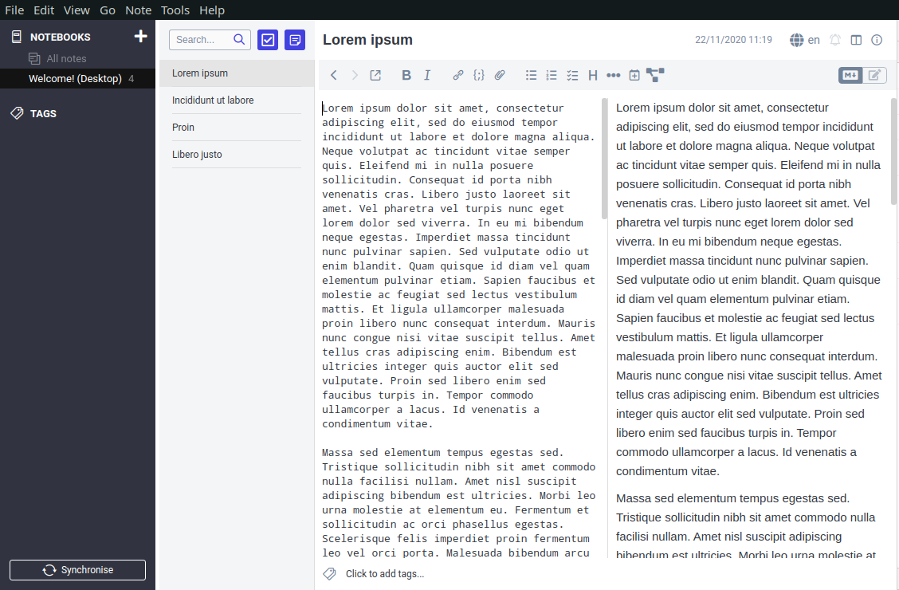
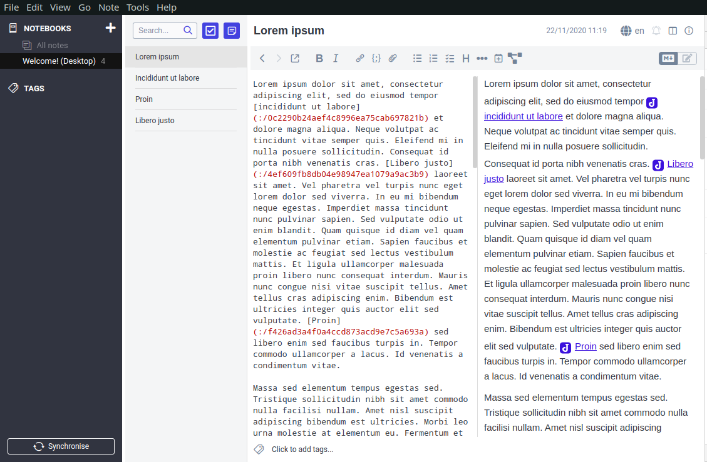

# Make all possible links

This plugin searches the current note for mentions of other notes, then makes the corresponding links.
Just click the new icon in the toolbar.

This plugin is experimental and comes with absolutely no warranty of any kind. Use at your own risk.

### Before 
 
### After clicking the icon
 

## Joplin Plugin

The main two files you will want to look at are:

- `/src/index.ts`, which contains the entry point for the plugin source code.
- `/src/manifest.json`, which is the plugin manifest. It contains information such as the plugin a name, version, etc.

The plugin is built using webpack, which create the compiled code in `/dist`. The project is setup to use TypeScript, although you can change the configuration to use plain JavaScript.

## Building the plugin

To build the plugin, simply run `npm run dist`.
